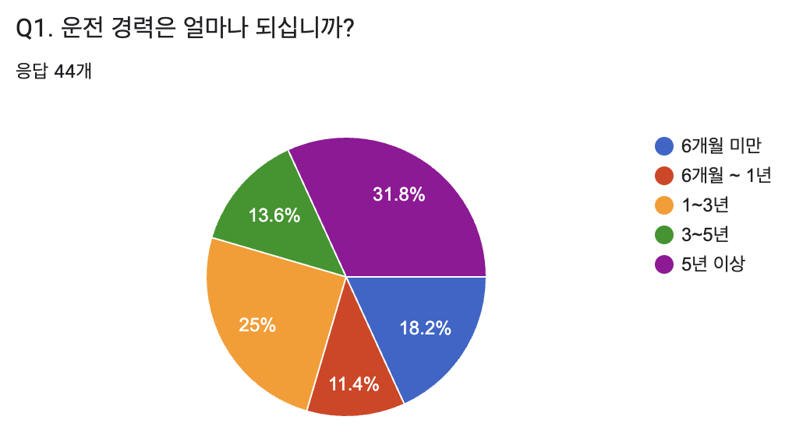
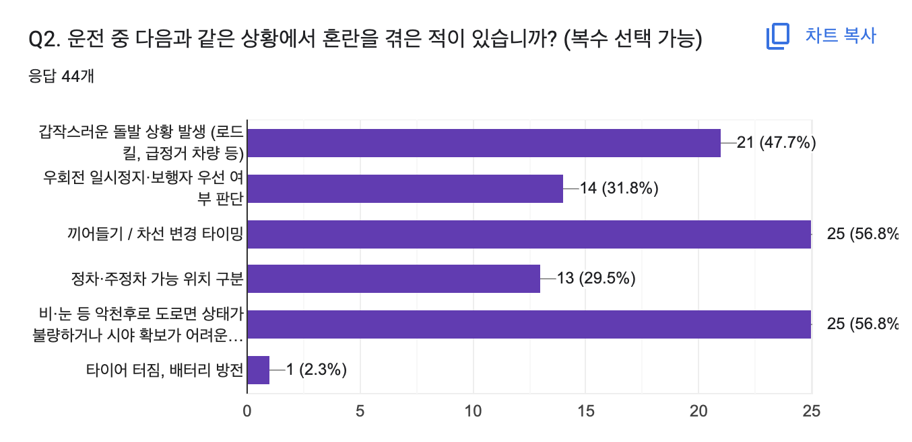
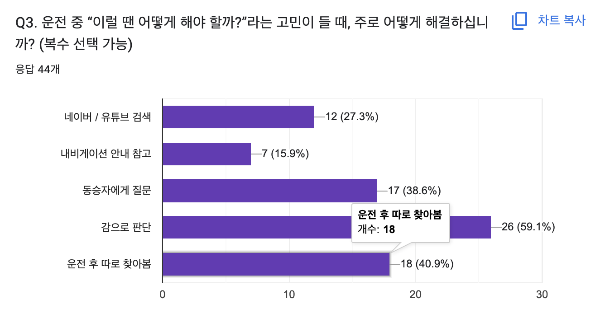
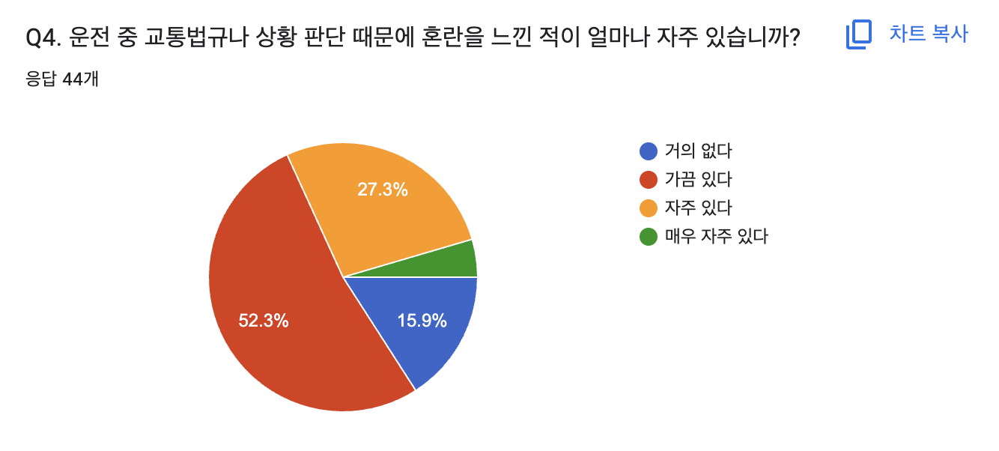
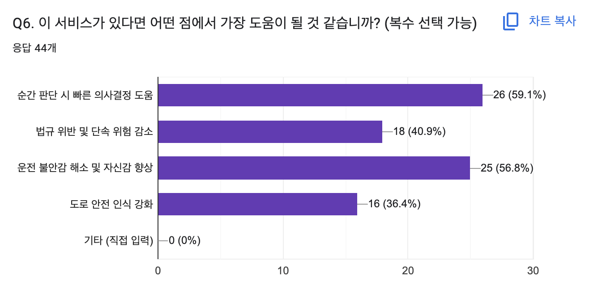

# SKN 17기 4th Project 5Team
> LLM을 연동한 내외부 문서 기반 질의 응답 웹페이지 개발   
  개발 기간 : 2025.10.24 - 2025.10.27

# 1. 팀 소개
### 🔸팀명: 모빌리티 브레인
> '교통과 관련해 두뇌를 맡는다'는 의미의 팀명입니다. 
### 🔸팀원 소개
| [@임길진](https://github.com/LGJ0405)                      | [@박민정](https://github.com/minjeon)                       |  [@이가은](https://github.com/Leegaeune)                       | [@한 훈](https://github.com/Hoonieboogie)                       |
|---------------------------------------------------------------|---------------------------------------------------------------------|---------------------------------------------------------------------|---------------------------------------------------------------------|
|  |  |  |  |

# 2. 프로젝트 개요
### 🔸프로젝트 명: 🚗 AI Driving Assistance 🚗 

### 🔸프로젝트 소개
**초보 운전자를 포함한 모든 운전자가 주행 중 겪는 불안과 혼란을 줄이고, 안전한 운전을 돕는 AI 기반 보이스봇·챗봇**

### 🔸프로젝트 배경

|  | |
|---------------------------|---------------------------|
| - 자동차 고장·사고 시 당황으로 인한 2차 사고 위험    - 교통 사고 2차 사고 치사율은 일반 교통 사고의 약 6배에 달하는 54%    - "고속도로 한복판에서 시동 꺼진 차량, 운전자가 대처 방법 몰라 뒤따라오던 차량과 추돌" 과 같은 기사 자주 보도    출처 : ["고속도로 교통사고 사망자 5명 중 1명 2차 사고로 사망"](https://www.yna.co.kr/view/AKR20240319052900053) / ["안전무지가 2차 사고 불러"](https://www.yna.co.kr/view/AKR20171213165200797) | - 초보 운전자들의 돌발 상황 대처 능력 부족    - 커뮤니티(네이버 지식인 등)에 운전 관련 질문이 반복적으로 게시    출처 : [네이버 지식인](https://kin.naver.com/index.nhn?mobile) |

 

### 🔸프로젝트 필요성
* 총 44명을 대상으로 본 프로젝트의 필요성에 관한 6개 항목 설문조사를 실시함.

#### 설문 결과

  

  

  

  
  <ul>
  <li>‘가끔 있다’ 단일 항목만 과반이 넘어감</li>
  <li>'자주 있다’와 ‘매우 자주 있다’도 도합 30%가 넘어감</li>
  </ul>

  
  <ul>
  <li>‘가끔 있다’ 단일 항목만 과반이 넘어감</li>
  <li>‘유용하다’와 ‘매우 유용하다’가 도합 80%를 넘아감</li>
  </ul>

  

 

# 3. WBS

# 4. 요구사항 정의서

🔸**회원정보 관련**

🔸**채팅 관련**

# 5. 화면설계서

# 6. 시스템 구성도

# 7. 기술 스택

| 분야                   | 기술 및 라이브러리 |
|------------------------|------------------|
| **프로그래밍 언어 & 개발환경** |      |
| **웹 프레임워크** |    |
| **임베딩 모델** |  |
| **모델 튜닝/학습 프레임워크** |    |
| **LLM 체인 및 자연어 처리** |  |
| **AI 모델** |  |
| **데이터베이스 및 임베딩** |  |
| **환경변수 관리** |  |
| **서버** |  |
| **인프라 및 배포** |   |
| **협업 및 형상관리** |     |

# 8. 테스트 계획 및 결과 보고서

# 9. 수행결과 (테스트 및 시연 페이지) 

# 10. 보완점 및 개선 방향 

# 11. 한 줄 회고
<table>
  <tr>
    <th width="10%">임길진</th>
    <td>KPT에 맞춰서 작성 부탁</td>
  </tr>
  <tr>
    <th>박민정</th>
    <td>KPT에 맞춰서 작성 부탁</td>
  </tr>
  <tr>
    <th>이가은</th>
    <td>KPT에 맞춰서 작성 부탁</td>
  </tr>
  <tr>
    <th>한 훈</th>
    <td>KPT에 맞춰서 작성 부탁</td>
  </tr>
</table>
